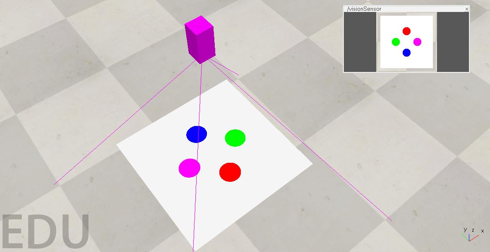

# Visual Servoing



Image-based visual servoing using circular markers as visual features.

## Project Overview

This project implements Image-Based Visual Servoing (IBVS) using color-based circular markers as visual features. The system controls a camera's motion to align current visual features with desired target positions, enabling automated visual positioning and tracking.

## Setup and run the simulation:

1. Open the scene `scenes/ibvs.ttt` in the CoppeliaSim simulator.
2. Install python dependencies:

```console
python3 -m venv .venv
source .venv/bin/activate
pip install -r requirements.txt
```

3. Run the simulation:

```console
python src/main.py
```

## Command Line Arguments

The system supports various feature transformations and control parameters:

- `--rotate` or `-r`: Rotation angle in degrees (default: 0)
- `--translate_u` or `-tu`: Horizontal translation in pixels (default: 0)
- `--translate_v` or `-tv`: Vertical translation in pixels (default: 0)
- `--scale` or `-s`: Scale factor for features (default: 1.0)
- `--gain` or `-g`: Control gain for IBVS (default: 0.1)
- `--depth` or `-d`: Depth of the features (default: 1.0)

Example:

```console
python src/main.py --rotate 45 --scale 1.2 --gain 0.15
```

## Predefined Transformations

The project includes a Makefile with several predefined transformations:

```console
# Apply 45 degree rotation
make rotation

# Scale features by 1.5x
make scale

# Translate features horizontally and vertically
make translation

# Apply all transformations together
make all
```

## Controls

While the simulation is running:

- Press 'q' to exit the simulation
- The camera window shows both target (green) and current (red) features
