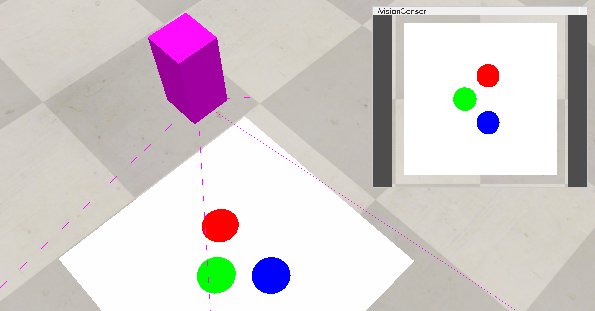

# ibvs



Image based visual servoing.

## Setup and run the simulation:

1. Open the scene `scenes/ibvs.ttt` in the CoppeliaSim simulator.
2. Install python dependencies:

```console
python3 -m venv .venv
source .venv/bin/activate
pip install -r requirements.txt
```

3. Run the simulation:

```console
python src/main.py
```

## Run tests

```console
pytest
```
